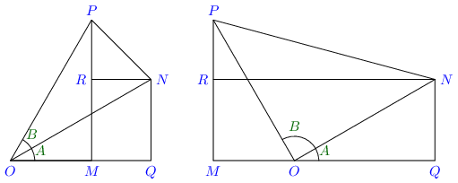
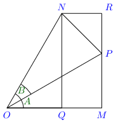

Compound Angles
***************
Algebraic sum of two or more angles is called a *compound angle*. If :math:`A, B, C` are any angle then :math:`A + B, A - B, A -
B + C, A + B + C, A - B - C, A + B -C` etc. are all compound angles.

The Addition Formula
====================
:math:`\sin(A + B) = \sin A\cos B + \sin B\cos A`

:math:`\cos(A + B) = \cos A\cos B - \sin A\sin B`

:math:`\tan(A + B) = \frac{\tan A + \tan B}{1 - \tan A\tan B}`

Consider the diagram above. :math:`PM` and :math:`PN` are perpendicualr to :math:`OQ` and :math:`ON`. :math:`RN` is parallel to
:math:`OQ` and :math:`NQ` is perpendicular to :math:`OQ`. The left diagram represents the case when sum of angles is an acute angle
while the right diagram represents the case when sum of angles is an obtuse angle.

:math:`\angle RPN = 90^{\circ} - \angle PNR = \angle RNO = \angle NOQ = \angle A`

Now we can write, :math:`\sin(A + B) = \sin QOP = \frac{MP}{OP} = \frac{MR + RP}{OP} = \frac{QN}{OP} + \frac{RP}{OP}`

:math:`=\frac{QN}{ON}\frac{ON}{OP} + \frac{RP}{NP}\frac{NP}{OP} = \sin A\cos B + \cos A\sin B`

Also, :math:`\cos(A + B) = \cos QOP = \frac{OM}{OP} = \frac{OQ - MQ}{OP} = \frac{OQ}{ON}\frac{ON}{OP} - \frac{RN}{NP}\frac{NP}{OP}`

:math:`= \cos A\cos B - \sin A\sin B`

These two results lead to :math:`\tan (A + B) = \frac{\tan A + \tan B}{1 - \tan A\tan B}`

We have shown that addition formula is true when angles involved are acute angles. The same proof can be applied to prove the
results for all values of :math:`A` and :math:`B`.

Consider :math:`A' = 90^{\circ} + A \therefore `\sin A' = \cos A` and :math:`\cos A' = \sin A`

:math:`\sin(A' + B) = \cos (A + B) = \cos A\cos B - \sin A\sin B = \sin A'\cos B + \cos A'\sin B`

Similarly :math:`\cos(A' + B) = -\sin(A + B) = -\sin A\cos B - \sin B\cos A = \cos A'\cos B - \sin A'\sin B`

We can prove it again for :math:`B' = 90^{\circ} + B` and so on by increasing the values of :math:`A` and :math:`B`. Then we can
again increase values by :math:`90^{\circ}` and proceeding this way we see that the formula holds true for all values of :math:`A`
and :math:`B`.

The Subtraction Formula
=======================
:math:`\sin(A - B) = \sin A\cos B - \sin B\cos A`

:math:`\cos(A - B) = \cos A\cos B + \sin A\sin B`

:math:`\tan(A - B) = \frac{\tan A - \tan B}{1 + \tan A\tan B}`

Conside the diagram above. The angle :math:`MOP` is :math:`A - B.` We take a point :math:`P,` and draw :math:`PM` and :math:`PN`
perpendicular to :math:`OM` and :math:`ON` respectively. From :math:`N` we draw :math:`NQ` and :math:`NR` perpendicular to
:math:`OQ` and :math:`MP` respectively.

:math:`\angle RPN = 90^{\circ} - \angle PNR = \angle QON = A`

Thus, we can write :math:`\sin(A - B) = \sin MOP = \frac{MP}{OP} = \frac{MR - PR}{OP} = \frac{QN}{ON}\frac{ON}{OP} -
\frac{PR}{PN}\frac{PN}{OP}`

Thus, :math:`\sin(A - B) = \sin A\cos B - \cos A\sin B`

Also, :math:`\cos(A - B) = \frac{OM}{OP} = \frac{OQ + QM}{OP} = \frac{OQ}{ON}\frac{ON}{OP} + \frac{RN}{NP}\frac{NP}{OP}`

:math:`= \cos A\cos B + \sin A\sin B`

We have shown that subtraction formula is true when angles involved are acute angles. The same proof can be applied to prove the
results for all values of :math:`A` and :math:`B`.

From the results obtained we find upon division that :math:`\tan(A - B) = \frac{\tan A - \tan B}{1 + \tan A\tan B}`

Important Deductions
====================
1. :math:`\sin(A + B)\sin(A - B) = \sin^2A - \sin^2B = \cos^2B - \cos^2A`

   **Proof:** L.H.S. :math:`= (\sin A\cos B + \sin B\cos A)(\sin A\cos B - \sin B\cos A)`

   :math:`= \sin^2A\cos^2B - \sin^2B\cos^2A = \sin^2A(1 - \sin^2B) - \sin^2B(1 - \sin^2A)`

   :math:`= \sin^2A - \sin^2A\sin^2B - \sin^2B + \sin^2B\sin^2A`

   :math:`= =\sin^2A - \sin^2B = (1 - \cos^2A) - (1 - \cos^2B)`

   :math:`= \cos^2B - \cos^2A`

2. :math:`\cos(A + B)\cos(A - B) = \cos^2A - \sin^2B = \cos^2B - \sin^2A`

   **Proof:** L.H.S. :math:`=(\cos A\cos B - \sin A\sin B)(\cos A\cos B + \sin A\sin B)`

   :math:`= \cos^2A\cos^2B - \sin^2A\sin^2B = \cos^2A(1- \sin^2B) - (1 - \cos^2A)\sin^2B`

   :math:`=\cos^2A - \cos^2A\sin^2B - \sin^2B + \cos^2A\sin^2B = \cos^2A - \sin^2B = \cos^2B - \sin^2A`

3. :math:`\cot(A + B) = \frac{\cot A\cot B - 1}{\cot B + \cot A}`

   **Proof:** L.H.S. :math:`= \cot(A + B) = \frac{\cos(A + B)}{\sin(A + B)}`

   :math:`= \frac{\cos A\cos B - \sin A\sin B}{\sin A\cos B + \cos A\sin B}`

   Dividing numberator and denominator by :math:`\sin A\sin B`

   :math:`= \frac{\cot A\cot B - 1}{\cot B + \cot A}`

4. :math:`\cot(A - B) = \frac{\cot A\cot B + 1}{\cot B - \cot A}`

   **Proof:** L.H.S. :math:`= \cot(A - B) = \frac{\cos(A - B)}{\sin(A - B)}`

   :math:`= \frac{\cos A\cos B + \sin A\sin B}{\sin A\cos B - \cos A\sin B}`

   Dividing numberator and denominator by :math:`\sin A\sin B`

   :math:`= \frac{\cot A\cot B + 1}{\cot B - \cot A}`

5. :math:`\tan(A + B + C) = \frac{\tan A + \tan B + \tan C - \tan A\tan B\tan C}{1 - \tan A\tan B - \tan B\tan C - \tan C\tan A}`

   **Proof:** L.H.S. :math:`= \tan[(A + B) + C] = \frac{\tan(A + B) + \tan C}{1 - \tan(A + B)\tan C}`

   :math:`= \frac{\frac{\tan A + \tan B}{1 - \tan A\tan B} + \tan C}{1 - \frac{\tan A + \tan B}{1 - \tan A\tan B}\tan C}`

   :math:`= \frac{\frac{\tan A + \tan B + \tan C - \tan A\tan B\tan C}{1 - \tan A\tan B}}{\frac{1 - \tan A\tan B - \tan B\tan C -
   \tan C\tan A}{1 - \tan A\tan B}}`

   :math:`= \frac{\tan A + \tan B + \tan C - \tan A\tan B\tan C}{1 - \tan A\tan B - \tan B\tan C - \tan C\tan A}`

To express :math:`a\cos\theta + b\sin\theta` in the form of :math:`k\cos\phi` or :math:`k\sin\phi`
==================================================================================================
:math:`a\cos\theta + b\sin\theta = \sqrt{a^2 + b^2}\left(\frac{a}{\sqrt{a^2 + b^2}}\cos\theta + \frac{b}{\sqrt{a^2 +
b^2}}\sin\theta\right)`

Let :math:`\cos\alpha = \frac{a}{\sqrt{a^2 + b^2}}` then :math:`\sin\alpha = \frac{b}{\sqrt{a^2 + b^2}}`

Thus, :math:`a\cos\theta + b\sin\theta = \sqrt{a^2 + b^2}(\cos\alpha\cos\theta + \sin\alpha\sin\theta)`

:math:`= \sqrt{a^2 + b^2}\cos(\theta - \alpha) = k\cos\phi` where :math:`k = \sqrt{a^2 + b^2}` and :math:`\phi = \theta - \alpha`

Alternatively, if :math:`\frac{a}{\sqrt{a^2 + b^2}} = \sin\alpha` then :math:`\frac{b}{\sqrt{a^2 + b^2}} = \cos\alpha`

Thus, :math:`a\cos\theta + b\sin\theta = \sqrt{a^2 + b^2}(\sin\alpha\cos\theta + \cos\alpha + \sin\theta)`

:math:`= \sqrt{a^2 + b^2}\sin(\theta + \alpha) = k\sin\phi` where :math:`k = \sqrt{a^2+b^2}` and :math:`\phi = \theta + \alpha`

Problems
========
1. If :math:`\sin\alpha = \frac{3}{5}` and :math:`\cos\beta = \frac{9}{41},` find the values of :math:`\sin(\alpha - \beta)` and
   :math:`\cos(\alpha + \beta).`

2. If :math:`\sin\alpha = \frac{45}{53}` and :math:`\sin\beta = \frac{33}{65},` find the values of :math:`\sin(\alpha - \beta)` and
   :math:`\sin(\alpha + \beta).`

3. If :math:`\sin\alpha = \frac{15}{17}` and :math:`\cos\beta = \frac{12}{13},` find the values of :math:`\sin(\alpha + \beta),
   \cos(\alpha - \beta)` and :math:`\tan(\alpha + beta).`

Prove the following:

4. :math:`\cos(45^{\circ} - A)\cos(45^{\circ} - B) - \sin(45^{\circ} - A)\sin(45^{\circ} - B) = \sin(A + B)`

5. :math:`\sin(45^{\circ} + A)\cos(45^\circ - B) + \cos(45^{\circ} + A)\sin(45^\circ - B) = \cos(A - B).`

6. :math:`\frac{\sin(A - B)}{\cos A\cos B} + \frac{\sin(B - C)}{\cos B\cos C} + \frac{\sin(C - A)}{\cos C\cos A} = 0`

7. :math:`\sin 105^\circ + \cos 105^\circ = \cos 45^\circ`

8. :math:`\sin 75^\circ - \sin 15^\circ = \cos 105^\circ + \cos 15^\circ`

9. :math:`\cos\alpha\cos(\gamma - \alpha) - \sin\alpha\sin(\gamma - \alpha) = \cos\gamma`

10. :math:`\cos(\alpha + \beta)\cos\gamma - \cos(\beta + \gamma)\cos\alpha = \sin\beta\sin(\gamma - \alpha)`

11. :math:`\sin(n + 1)A\sin(n - 1)A + \cos(n + 1)A\cos(n - 1)A = \cos 2A`

12. :math:`\sin(n + 1)A\sin(n + 2)A + \cos(n + 1)A\cos(n + 2)A = \cos A`

13. Find the value of :math:`\cos 15^\circ` and :math:`\sin 105^\circ`

14. Find the value of :math:`\tan 105^\circ`

15. Find the value of :math:`\frac{\tan 495^\circ}{\cot 855^\circ}`

16. Evaluate :math:`\sin\left(n\pi + (-1)^n \frac{\pi}{4}\right),` where :math:`n` is an integer.

Prove the following:

17. :math:`\sin 15^\circ = \frac{\sqrt{3} - 1}{2\sqrt{2}}`

18. :math:`\cos 75^\circ = \frac{\sqrt{3} - 1}{2\sqrt{2}}`

19. :math:`\tan 75^\circ = 2 + \sqrt{3}`

20. :math:`\tan 15^\circ = 2 - \sqrt{3}`

Find the value of following:

21. :math:`\cos 1395^\circ`

22. :math:`\tan(-330^\circ)`

23. :math:`\sin 300^\circ \cosec 1050^\circ - \tan(-120^\circ)`

24. :math:`\tan\left(\frac{11\pi}{12}\right)`

25. :math:`\tan \left((-1)^n\frac{\pi}{4}\right)`

Prove the following:

26. :math:`\cos 18^\circ - \sin 18^\circ = \sqrt{2}\sin 27^\circ`

27. :math:`\tan 70^\circ = 2\tan 50^\circ + \tan 20^\circ`

28. :math:`\cot\left(\frac{\pi}{4} + x\right)\cot\left(\frac{\pi}{4} - x\right) = 1`

29. :math:`\cos(m + n)\theta.\cos(m - n)\theta - \sin(m + n)\theta\sin(m - n)\theta = \cos 2m\theta`

30. :math:`\frac{\tan(\theta + \phi) + \tan(\theta - \phi)}{1 - \tan(\theta + \phi)\tan(\theta - \phi)} = \tan 2\theta`

31. :math:`\cos 9^\circ + \sin 9^\circ = \sqrt{2}\sin 54^\circ`

32. :math:`\frac{\cos 20^\circ - \sin 20^\circ}{\cos 20^\circ + \sin 20^\circ} = \tan 25^\circ`

33. :math:`\frac{\tan A + \tan B}{\tan A - \tan B} = \frac{\sin(A + B)}{\sin(A - B)}`

34. :math:`\frac{1}{\tan 3A - \tan A} - \frac{1}{\cot 3A - \cot A} = \cot 2A`

35. :math:`\frac{1}{\tan 3A + \tan A} - \frac{1}{\cot 3A - \cot A} = \cot 4A`

36. :math:`\frac{\sin 3\alpha}{\sin\alpha} + \frac{\cos 3\alpha}{cos\alpha} = 4\cos 2\alpha`

37. :math:`\frac{\tan\left(\frac{\pi}{4} + A \right) - \tan\left(\frac{\pi}{4} - A\right)}{\tan\left(\frac{\pi}{4} + A\right) +
    \tan\left(\frac{\pi}{4} - A\right)} = \sin 2A`

38. :math:`\tan 40^\circ + 2 \tan 10^\circ = \tan 50^\circ`

39. :math:`\tan(\alpha + \beta)\tan(\alpha - \beta) = \frac{\sin^2\alpha - \sin^2\beta}{\cos^2\alpha - \sin^2\beta}`

40. :math:`\tan^2\alpha -\tan^\beta = \frac{\sin(\alpha + \beta)\sin(\alpha - \beta)}{\cos^2\alpha\cos^2\beta}`

41. :math:`\tan[(2n + 1)\pi + \theta] + \tan[(2n + 1)\pi - \theta] = 0`

41. :math:`\tan\left(\frac{\pi}{4} + \theta\right)\tan\left(\frac{3\pi}{4} + \theta\right) + 1 = 0`

42. If :math:`\tan\alpha = p` and :math:`\tan\beta = q` prove that :math:`\cos(\alpha + \beta) = \frac{1 - pq}{\sqrt{(1 + p^2)(1 +
    q^2)}}`

43. if :math:`\tan \beta = \frac{2\sin\alpha\sin\gamma}{\sin(\alpha + \gamma)},` show that :math:`\cot\alpha, \cot\beta,
    \cot\gamma` are in A.P.

44. Eliminate :math:`\theta` if :math:`\tan(\theta - \alpha) = a` and :math:`\tan(\theta + \alpha) = b`

45. Eliminate :math:`\alpha` and :math:`\beta` if :math:`\tan\alpha + \tan\beta = b, \cot\alpha + \cot\beta = a` and
    :math:`\alpha + \beta = \gamma`

46. If :math:`A + B = 45^\circ,` show that :math:`(1 + \tan A)(1 + \tan B) = 2`

47. If :math:`\sin\alpha\sin\beta - \cos\alpha\cos\beta + 1 = 0,` prove that :math:`1 + \cot\alpha\tan\beta = 0`

48. If :math:`\tan\beta = \frac{n\sin\alpha\cos\alpha}{1 - n\sin^2\alpha},` prove that :math:`\tan(\alpha - \beta) = (1 - n)\alpha`

49. If :math:`\cos(\beta - \gamma) + \cos(\gamma - \alpha) + \cos(\alpha - \beta) = -\frac{3}{2},` prove that :math:`\cos\alpha +
    \cos\beta + \cos\gamma = \sin\alpha + \sin\beta + \sin\gamma = 0`

50. If :math:`\tan\alpha = \frac{m}{m + 1}, \tan\beta = \frac{1}{2m + 1},` prove that :math:`\alpha + \beta = \frac{\pi}{4}`

51. If :math:`A + B = 45^\circ,` show that :math:`(\cot A - 1)(\cot B - 1) = 2`

52. If :math:`\tan\alpha - \tan\beta = x` and :math:`\cot\beta - \cot\alpha = y,` prove that :math:`\cot(\alpha - \beta) =
    \frac{x + y}{xy}`

53. If a right angle be divided into three pats :math:`\alpha, \beta` and :math:`\gamma,` prove that :math:`\cot\alpha =
    \frac{\tan\beta + \tan\gamma}{1 - \tan\beta\tan\gamma}`

54. If :math:`2\tan\beta + \cot \beta = \tan\alpha,` show that :math:`\cot \beta = 2\tan(\alpha - \beta)`

55. If in any :math:`\triangle ABC, C = 90^\circ,` prove that :math:`\cosec(A - B) = \frac{a^2 + b^2}{a^2 - b^2}` and :math:`\sec(A
    - B) = \frac{c^2}{2ab}`

56. If :math:`\cot A = \sqrt{ac}, \cot B = \sqrt{\frac{c}{a}}, \tan C = \sqrt{\frac{c}{a^3}}` and :math:`c = a^2 + a + 1,` prove
    that :math:`A = B + C`

57. If :math:`\frac{\tan(A - B)}{\tan A} + \frac{\sin^2C}{\sin^2A} = 1,` prove that :math:`\tan A\tan B = \tan^2 C`

58. If :math:`\sin\alpha\sin\beta - \cos\alpha\cos\beta = 1` show that :math:`\tan\alpha + \tan\beta = 0`

59. If :math:`\sin\theta = 3\sin(\theta + 2\alpha),` prove that :math:`\tan(\theta + \alpha),` prove that :math:`\tan(\theta +
    \alpha) + 2\tan\alpha = 0`

60. If :math:`3\tan\theta\tan\phi = 1,` prove that :math:`2\cos(\theta + \phi) = \cos(\theta - \alpha)`

61. Find the sign of the expression :math:`\sin\theta + \cos\theta` when :math:`\theta = 100^\circ`

62. Prove that the value of :math:`5\cos\theta + 3\cos\left(\theta + \frac{\pi}{3}\right) + 3` lies between :math:`-4` and
    :math:`10`

63. If :math:`m\tan(\theta - 30^\circ) = n\tan(\theta + 120^\circ),` show that :math:`\cos2\theta = \frac{m + n}{2(m - n)}`

64. if :math:`\alpha + \beta = \theta` and :math:`\tan\alpha:\tan\beta = x:y,` prove that :math:`\sin(\alpha - \beta) = \frac{x -
    y}{x + y}\sin\theta`

65. Find the maximum and minimum value of :math:`7\cos\theta + 24\sin\theta`

66. Show that :math:`\sin 100^\circ - \sin 10^\circ` is positive.
