Properties of Triangles
***********************
In this chapter we will study the relations between the sides and trigonometrical ratios of the angles of a triangle. We already
know that a triangle has three sides and three angles. In a :math:`\triangle ABC` we will denote the angles :math:`BAC, CBA, ACB`
by :math:`A, B, C` and the corresponsing sides i.e. sides opposite to them by :math:`a, b, c` respectively.

Thus, :math:`BC = a, AC = b, AB = c`

We will also denote the radius of the circumcircle of the :math:`\triangle ABC` by :math:`R` and the area by :math:`\triangle.` We
also know some basic properties of a triangle for example, :math:`A + B  + C = 180^\circ` and :math:`a + b > c, b + c > a, c + a >
b`

Sine Formula or Sine Rule or Law of Sines
=========================================
In :math:`\triangle ABC, \frac{a}{\sin A} = \frac{b}{\sin B} = \frac{c}{\sin C}`

**Proof: Case I.** When :math:`\angle C` is acute:

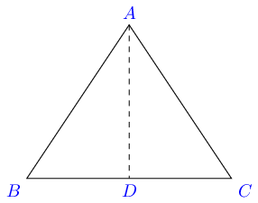

From :math:`A` draw :math:`AD \perp BC.` From :math:`\triangle ABD,`

:math:`\sin B = \frac{AD}{AB} = \frac{AD}{c}\Rightarrow AD = c\sin B`

From :math:`\triangle ACD,`

:math:`\sin C = \frac{AD}{AC} = \frac{AD}{b}\Rightarrow AD = b\sin C`

Thus, :math:`c\sin B = b\sin C`

**Case II.** When :math:`\angle C` is obtuse:

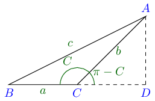

From :math:`A` draw :math:`AD \perp BC.` From :math:`\triangle ABD,`

:math:`\sin B = \frac{AD}{AB} = \frac{AD}{c}\Rightarrow AD = c\sin B`

From :math:`\triangle ACD,`

:math:`\sin(\pi - C) = \frac{AD}{AC} = \frac{AD}{b}\Rightarrow AD = b\sin C`

Thus, :math:`c\sin B = b\sin C`

**Case III.** When :math:`\angle C` is :math:`90^\circ`

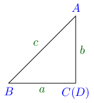

From :math:`A` draw :math:`AD \perp BC.` From :math:`\triangle ABD,`

:math:`\sin B = \frac{AD}{AB} = \frac{AD}{c}\Rightarrow AD = c\sin B`

:math:`\Rightarrow AC = c\sin B[\because C` and :math:`D` are same points :math:`]`

:math:`b = c\sin B \Rightarrow b\sin90^\circ = c\sin B`

:math:`\Rightarrow b\sin C = c\sin B`

Thus, from all cases we have established that :math:`\frac{b}{\sin B} = \frac{c}{\sin C}`

Similarly by drawing perpendicular from :math:`C` to :math:`AB,` we can prove that

:math:`\frac{a}{\sin A} = \frac{b}{\sin B}`

and thus

:math:`\triangle ABC, \frac{a}{\sin A} = \frac{b}{\sin B} = \frac{c}{\sin C}`

In :math:`\triangle ABC, \frac{a}{\sin A} = \frac{b}{\sin B} = \frac{c}{\sin C} = 2R` where :math:`R` is the radius of the
circumcircle of :math:`\triangle ABC`

**Case I.** When :math:`\angle A` is acute.

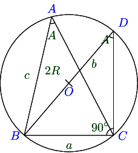

From :math:`\triangle BDC,`

:math:`\sin A = \frac{BC}{BD} = \frac{a}{2R} \Rightarrow \frac{a}{\sin A} = 2R`

**Case II.** When :math:`\angle A` is obtuse.

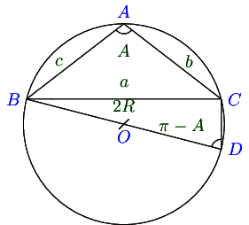

From :math:`\triangle BDC,`

:math:`\sin (\pi - A) = \frac{BC}{BD} = \frac{a}{2R} \Rightarrow \frac{a}{\sin A} = 2R`

**Case III.** When :math:`\angle A` is :math:`90^\circ`.

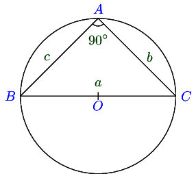

From :math:`\triangle BDC,`

:math:`a = BC = 2R \Rightarrow \frac{a}{\sin A} = 2R`

Thus, in all three cases :math:`\frac{a}{\sin A} = 2R`

Similalry, by joining the diameter through :math:`A` and :math:`O` and through :math:`C` and :math:`O,` we can show that
:math:`\frac{b}{\sin B} = 2R` and :math:`\frac{c}{\sin C} = 2R`

Thus, :math:`\frac{a}{\sin A} = \frac{b}{\sin B} = \frac{c}{\sin C} = 2R`

Tangent Rule
============
In any :math:`\triangle ABC,`

:math:`\tan \frac{B - C}{2} = \frac{b - c}{b + c}\cot \frac{A}{2},` :math:`\tan \frac{A - B}{2} = \frac{a - b}{a + b}\cot
\frac{C}{2}` and :math:`\tan \frac{C - A}{2} = \frac{c - a}{c + a}\cot \frac{B}{2}`

**Proof:** By sine formula, :math:`\frac{a}{\sin A} = \frac{b}{\sin B} = \frac{c}{\sin C} = K` (say)

:math:`\therefore b = K\sin B, c = k\sin C`

:math:`\Rightarrow \frac{b - c}{b + c} = \frac{K(\sin B - \sin C)}{K(\sin B + \sin C)} = \frac{2\cos\frac{B + C}{2}\sin\frac{B -
C}{2}}{2\sin \frac{B + C}{2}\cos\frac{B - C}{2}}`

:math:`= \cot\frac{B + C}{2}\tan\frac{B - C}{2} = \tan\frac{A}{2}\tan \frac{B - C}{2} \Rightarrow \tan \frac{B - C}{2} = \frac{b -
c}{b + c}\cot \frac{A}{2}`

Similarly, we can prove remaining two equations.

Cosine Formula or Cosine Rule
=============================
In any :math:`\triangle ABC,`

:math:`\cos A = \frac{b^2 + c^2 - a^2}{2bc}, \cos B = \frac{c^2 + a^2 - b^2}{2ca}, \cos C = \frac{a^2 + b^2 - c^2}{2ab}`

**Case I.** When :math:`\angle C` is acute.

:math:`AD = b\sin C`

:math:`\cos C = \frac{CD}{AC} \Rightarrow CD = b\cos C \Rightarrow BD = BC - CD = a - b\cos C`

**Case II.** When :math:`\angle C` is obtuse.

:math:`AD = b\sin(\pi - C) = b\sin C`

:math:`\cos (\pi - C) = \frac{CD}{AC} \Rightarrow CD = -b\cos C \Rightarrow BD = BC + CD = a - b\cos C`

**Case III.** When :math:`\angle C` is :math:`90^\circ`.

Here, :math:`C` and :math:`D` are same points. :math:`AD = AC = b = b\sin C`

:math:`\angle C = 90^\circ\therefore \sin C = 1`

:math:`CD = 0 = b\cos C \because \cos C = \cos 90^\circ = 0`

:math:`BD = BC - CD = a - b\cos C`

Thus, in all cases :math:`AD = b\sin C` and :math:`BD = a - b\cos C`

Now, :math:`AB^2 = AD^2 + BD^2`

:math:`\Rightarrow c^2 = b^2\sin^2C + (a - b\cos C)^2 = a^2 + b^2 - 2ab\cos C`

:math:`\cos C = \frac{a^2 + b^2 - c^2}{2ab}`

Similarly, we can prove it for :math:`\angle A` and :math:`\angle B.`

Projection Formula
==================
In any :math:`\triangle ABC,` :math:`c = a\cos B + b\cos A, b = c\cos A + a\cos C, a = b\cos C + c\cos A`

**Proof: Case I.** When :math:`\angle C` is acute:

:math:`BC = a = BD + CD = c\cos B + b\cos C`

**Case II.** When :math:`\angle C` is obtuse:

:math:`BC = a = BD - CD = c\cos B - b\cos(\pi - C) = c\cos B + b\cos C`

**Case III.** When :math:`\angle C` is :math:`90^\circ`

:math:`BD = a = BC + CD = c\cos B + b\cos C[\because C=90^\circ \cos C = 0]`

Thus, in all cases :math:`a = b\cos C + c\cos B,` similarly we can prove for other sides as well.

Sub Angle Rules
===============
In any :math:`\triangle ABC,`

:math:`\sin \frac{A}{2} = \sqrt{\frac{(s - b)(s - c)}{bc}}`

:math:`\cos \frac{A}{2} = \sqrt{\frac{s(s - a)}{bc}}`

:math:`tan \frac{A}{2} = \sqrt{\frac{(s - b)(s - c)}{s(s - a)}}`

where :math:`2s = a + b + c`

**Proof:**

(i) :math:`2\sin^2\frac{A}{2} = 1 - \cos A = 1 - \frac{b^2 + c^2 - a^2}{2bc}`

    :math:`= \frac{2bc - b^2 - c^2 + a^2}{2bc} = \frac{a^2 - (b - c)^2}{2bc} = \frac{(a + b - c)(a + c - b)}{2bc}`

    :math:`= \frac{(2s - 2c)(2s - 2b)}{2bc} = \frac{2(s - b)(s - c)}{bc}`

    :math:`\Rightarrow \sin^2\frac{A}{2} = \frac{(s - b)(s - c)}{bc}`

    :math:`\Rightarrow \sin \frac{A}{2} = \pm\sqrt{\frac{(s - b)(s - c)}{bc}}`

    But :math:`\frac{A}{2},` is an acute angle so :math:`\sin \frac{A}{2} > 0`

    :math:`\therefore \sin \frac{A}{2} = \sqrt{\frac{(s - b)(s - c)}{bc}}`

(ii) :math:`2\cos^2\frac{A}{2} = 1 + \cos A = 1 + \frac{b^2 + c^2 - a^2}{2bc}`

     :math:`= \frac{(b + c)^2 - a^2}{2bc} = \frac{(a + b + c)(b + c - a)}{2bc}`

     :math:`= \frac{2s(2s - 2a)}{2bc} = \frac{2s(s - a)}{bc}`

     :math:`\Rightarrow \cos^2\frac{A}{2} = \frac{s(s - a)}{bc}`

     :math:`\cos\frac{A}{2} = \pm\sqrt{\frac{s(s - a)}{bc}}`

     But :math:`\frac{A}{2}` is an acute angle so :math:`\cos\frac{A}{2} > 0`

     :math:`\therefore \cos\frac{A}{2} = \sqrt{\frac{s(s - a)}{bc}}`

(iii) From 1 and 2 it follows that :math:`\tan\frac{A}{2} = \sqrt{\frac{(s - b)(s - c)}{s(s - a)}}`

Similarly, we can prove that :math:`\sin\frac{B}{2} = \sqrt{\frac{(s - c)(s - a)}{ca}}, \sin\frac{C}{2} = \sqrt{\frac{(s - a)(s -
b)}{ab}},` :math:`\cos\frac{B}{2} = \sqrt{\frac{s(s - b)}{ca}}, \cos\frac{C}{2} = \sqrt{\frac{s(s - c)}{ab}},`
:math:`\tan\frac{B}{2} = \sqrt{\frac{(s - c)(s - a)}{s(s - b)}}, \tan\frac{C}{2} = \sqrt{\frac{(s - a)(s - b)}{s(s - c)}}`

Sines of Angles in Terms of Sides
=================================
In any :math:`\triangle ABC`

:math:`\sin A = \frac{2}{bc}\sqrt{s(s - a)(s - b)(s - c)}`

:math:`\sin B = \frac{2}{ca}\sqrt{s(s - a)(s - b)(s - c)}`

:math:`\sin C = \frac{2}{ab}\sqrt{s(s - a)(s - b)(s - c)}`

**Proof:** :math:`\sin A = 2\sin\frac{A}{2}\cos\frac{A}{2}`

:math:`= 2\sqrt{\frac{(s - b)(s - c)}{bc}}\sqrt{\frac{s(s - a)}{bc}}`

:math:`= \frac{2}{bc}\sqrt{s(s - a)(s - b)(s - c)}`

Similarly, we can prove it for other angles.

Area of a Triangle
==================
If :math:`\triangle` denotes the area of :math:`\triangle ABC,` then

:math:`\triangle = \frac{1}{2}ab\sin C = \frac{1}{2}bc\sin A = \frac{1}{2}ca\sin B`

**Proof: Case I.** When :math:`\angle C` is acute:

:math:`\sin C = \frac{AD}{AC} \Rightarrow AD = b\sin C`

:math:`\triangle = \frac{1}{2}BC\times AD = \frac{1}{2}ab\sin C`

**Case II.** When :math:`\angle C` is obtuse:

:math:`\sin(\pi - C) = \frac{AD}{AC} \Rightarrow AD = b\sin C`

:math:`\triangle = \frac{1}{2}BC\times AD = \frac{1}{2}ab\sin C`

**Case III.** When :math:`\angle C` is :math:`90^\circ`

:math:`\triangle = \frac{1}{2}BC\times AD = \frac{1}{2}ab\sin C[\because C=90^\circ \therefore \sin C = 1]`

Thus, in all cases :math:`\triangle = \frac{1}{2}ab\sin C`

Similarly, we can prove two other formulas.

Area in Terms of Sides
----------------------
If :math:`\triangle` be the area of any :math:`\triangle ABC,` then

:math:`\triangle = \sqrt{s(s - a)(s - b)(s - c)}`

**Proof:** :math:`\triangle = \frac{1}{2}ab\sin C = \frac{1}{2}ab.2\sin\frac{C}{2}\cos\frac{C}{2}`

:math:`= ab\sqrt{\frac{(s - a)(s - b)}{ab}}\frac{s(s - c)}{ab} = \sqrt{s(s - a)(s - b)(s - c)}`

Area in Terms of Radius of Circumcircle
^^^^^^^^^^^^^^^^^^^^^^^^^^^^^^^^^^^^^^^
:math:`\triangle = \frac{1}{2}ab\sin C = \frac{1}{2}ab.\frac{c}{2R} = \frac{abc}{4R}`

Tangent and Cotangent of Sub-angles of a Triangle
=================================================
In any :math:`\triangle ABC, \tan\frac{A}{2} = \frac{(s - b)(s - c)}{\triangle}, \tan \frac{B}{2}= \frac{(s - a)(s -
c)}{\triangle}, \tan \frac{C}{2} = \frac{(s - a)(s - b)}{\triangle},` :math:`\cot\frac{A}{2} = \frac{s(s - a)}{\triangle},
\cot\frac{B}{2} = \frac{s(s - b)}{\triangle}, \cot\frac{C}{2} = \frac{s(s - c)}{triangle}`

**Proof:** :math:`\tan\frac{A}{2} = \sqrt{\frac{(s - b)(s - c)}{s(s - a)}} = \sqrt{\frac{(s - b)^2(s - c)^2}{s(s - a)(s - b)(s -
c)}}`

:math:`= \frac{(s - b)(s - c)}{\triangle}`

Similarly, we can prove it for other angles and cotangents.

Dividing a Side in a Ratio
==========================
If :math:`D` be a point on the side :math:`BC` of a :math:`\triangle ABC` such that :math:`BD:DC = m:n` and :math:`\angle
ADC=\theta, \angle BAD=\alpha` and :math:`\angle DAC=\beta,` then

1. :math:`(m + n)\cot\theta = m\cot\alpha - n\cot\beta`

2. :math:`(m + n)\cot\theta = n\cot B - m\cot C`

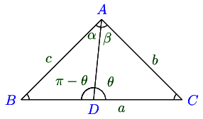

**Proof:**

1. :math:`\angle ADB = \pi - \theta, \angle ABD = \pi - (\alpha + \pi - \theta) = \theta - \alpha`

   :math:`\angle ACD = \pi - (\theta + \beta)`

   From :math:`\triangle ABC, \frac{BD}{\sin\alpha} = \frac{AD}{\sin(\theta - \alpha)}`

   From :math:`\triangle ADC, \frac{DC}{\sin]beta} = \frac{AD}{\sin[\pi - (\theta + \beta)]}`

   :math:`\Rightarrow \frac{DC}{\sin\beta} = \frac{AD}{\sin(\theta + \beta)}`

   Dividing, we get

   :math:`\frac{BD\sin\beta}{DC\sin\alpha} = \frac{\sin(\theta + \beta)}{\sin(\theta - \alpha)}`

   :math:`\Rightarrow \frac{m\sin\beta}{n\sin]\alpha} = \frac{\sin]theta\cos\beta + \cos\theta\cos\beta}{\sin\theta\cos\alpha - \cos\theta\sin\alpha}`

   :math:`\Rightarrow m\sin\theta\sin\beta\cos\alpha - m\cos\theta\sin\alpha\sin\beta = n\sin\alpha\sin\theta\cos\beta + n\sin\alpha\cos\theta\sin\beta`

   Dividing both sides by :math:`\sin\alpha\sin\beta\sin\theta,` we get

   :math:`m\cot\alpha - m\cot\theta = n\cot\beta + n\cot\theta`

   :math:`\Rightarrow (m + n)\cot\theta = m\cot\alpha - n\cot\beta`

2. :math:`\angle BAD = 180^\circ - (180^\circ - \theta + B) = \theta - B`

   :math:`\angle DAC = 180^\circ - (\theta + C)`

   From :math:`\triangle BAD, \frac{BD}{\sin(\theta - B)} = \frac{AD}{\sin B}`

   From :math:`\triangle ADC, \frac{DC}{\sin(180^\circ - (\theta + C))} = \frac{AD}{\sin C}`

   :math:`\Rightarrow \frac{DC}{\sin(\theta + C)} = \frac{AD}{\sin C}`

   Dividing, we get

   :math:`\frac{BD}{DC}.\frac{\sin(\theta + C)}{\sin(\theta - B)} = \frac{\sin C}{\sin B}`

   :math:`\Rightarrow \frac{m}{b}\frac{\sin\theta\cos C + \cos\theta\sin C}{\sin\theta\cos B - \cos\theta\sin B} = \frac{\sin C}{\sin C}`

   Proceeding like previous proof, we get

   :math:`(m + n)\cot\theta = n\cot B - m\cot C`

Results Related with Circum Circle
==================================
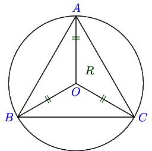

The circle passing through the vertices of a triangle is called circumcircle. Its radius is called circumradius. Let :math:`O` be
the center of the circumscribing circle of :math:`\triangle ABC.`

Clearly, :math:`OA = OB = OC = R`

In a :math:`\triangle ABC, R = \frac{abc}{4\Delta}`

**Proof:** By sine rule, :math:`\frac{a}{\sin A} = 2R \Rightarrow R = \frac{a}{2\sin A}`

:math:`\because \Delta = \frac{1}{2}bc\sin A \therefore \sin A = \frac{2\Delta}{bc}`

:math:`\Rightarrow R = \frac{a}{\frac{2.2\Delta}{bc}} = \frac{abc}{4\Delta}`

Results Related with In-Circle
==============================
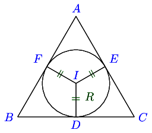

The circle touching all the three sides of a triangle internally is called the inscribed circle or in-circle. Its radius is called
in-radius and denoted by :math:`r`. In the figure :math:`I` is the in-center of the :math:`\triangle ABC.`

Clearly, it is the point of intersection of internal bisector of angles of the :math:`\triangle ABC.`

Clearly, :math:`ID = IE = IF = r`

In a :math:`\triangle ABC, r = \frac{\Delta}{s}`

**Proof:** Area of :math:`\triangle ABC = \triangle IBC + \triangle ICA + \triangle IAB`

:math:`\Rightarrow \Delta = \frac{1}{2}ar + \frac{1}{2}br + \frac{1}{2}cr`

:math:`\Rightarrow r = \frac{\Delta}{s}`

Other Forms
-----------
1. :math:`r = 4R\sin\frac{A}{2}\sin\frac{B}{2}\sin\frac{C}{2}`

   **Proof:** :math:`4R\sin\frac{A}{2}\sin\frac{B}{2}\sin\frac{C}{2} = 4.\frac{abc}{4\Delta}\sqrt{\frac{(s - b)(s -
   c)}{bc}}.\sqrt{\frac{(s - a)(s - c)}{ca}}.\sqrt{\frac{(s - a)(s - b)}{ab}}`

   :math:`= \frac{abc}{\Delta}.\frac{(s - a)(s - b)(s - c)}{abc}.\frac{s}{s}`

   :math:`= \frac{abc}{\Delta}.\frac{\Delta}{s} = \frac{\Delta}{s} = r`

2. :math:`r = (s - a)\tan\frac{A}{2} = (s - b)\tan\frac{B}{2} = (s - c)\tan\frac{C}{2}`

   :math:`r = \frac{\Delta}{s} = \frac{\Delta}{s}.\frac{s - a}{s - a} = (s - a)\tan\frac{A}{2}`

   Similarly, we can prove for other angles.

Results Related with Escribed Circles
=====================================
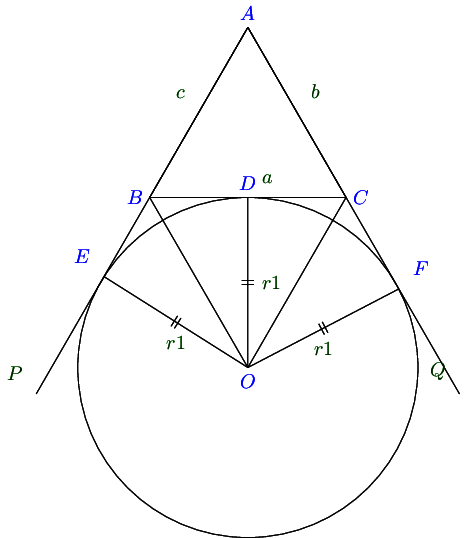

Let :math:`ABC` be a triangle. Let two sides :math:`AB` and :math:`AC` be extended to :math:`AP` and :math:`AQ` respectively. Let
the bisectors of exterior angles :math:`B` and :math:`C` meet at :math:`I.` Let :math:`ID\perp BC.` If we take :math:`I` as the
center and :math:`ID` as the radius and draw a circle, it will touch all the three sides(two extended sides and :math:`BC`) of the
triangle. The circle is called escribed circle to the triangle :math:`ABC.` Three such circles can be drawn, each opposite to each
angle. We denotge these radii by :math:`r_1, r_2` and :math:`r_3.` for angles :math:`A, B` and :math:`C` respectively.

In such a triangle :math:`ABC,` :math:`r_1 = \frac{\Delta}{s - a}, r_2 = \frac{\Delta}{s - b}, r_3 = \frac{\Delta}{s - c}`

**Proof:** Area of :math:`\triangle ABC = \Delta IAB + \Delta IAC - \Delta IBC`

:math:`= \frac{1}{2}cr_1 + \frac{1}{2}br_1 - \frac{1}{2}ar_1`

:math:`= \frac{1}{2}(b + c - a)r_! = \frac{1}{2}(a + b + c - 2a)r1 = \frac{1}{2}(2s - 2a)r_1 = (s - a)r_1`

:math:`\Rightarrow r_1 = \frac{\Delta}{s - a}`

Similarly, it can be proven for :math:`r_2` and :math:`r_3.`

Other Forms
-----------
1. :math:`r_1 = s\tan\frac{A}{2} = 4R\sin\frac{A}{2}\cos\frac{B}{2}\cos\frac{C}{2}`

2. :math:`r_2 = s\tan\frac{B}{2} = 4R\cos\frac{A}{2}\sin\frac{B}{2}\cos\frac{C}{2}`

3. :math:`r_3 = s\tan\frac{C}{2} = 4R\cos\frac{A}{2}\cos\frac{B}{2}\sin\frac{C}{2}`

Distannces of Circum-center, In-center, Orthocenter and Centroid from Vertices
==============================================================================
We have already shown that for circum-center distance is equal to circum-radius i.e. :math:`R`

Referring to the image of in-circle, :math:`IF = r, \angle FAI = \frac{A}{2}`

From right-angle triangle :math:`FIA, \sin\frac{A}{2} = \frac{r}{AI} \Rightarrow AI = r\cosec\frac{A}{2}`

Similarly, :math:`BI = r\cosec\frac{B}{2}` and :math:`CI = r\cosec\frac{C}{2}`

Orthocenter
-----------
Orthocenter is point of intersection of perpendiculars from a vertex to opposite side.

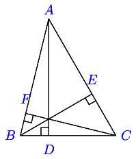

Let the orthocenter be :math:`H` which is intersection of perpendiculars from any vertex to opposite side.

From right angle triangle :math:`AEB, \cos A= \frac{AE}{AB} \Rightarrow AE = c\cos A`

From right angle triangle :math:`ADC, \angle DAC = 90^\circ - C`

From right angle triangle :math:`AEH, \cos(90^\circ - C) = \frac{AE}{AH}`

:math:`\Rightarrow AH = \frac{c\cos A}{\sin C} = 2R\cos A`

Similarly, :math:`BH = 2R\cos B, CH=2R\cos C`

Centroid
--------
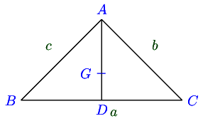

Let :math:`G` be the centroid. Since, it is the point of intersection of medians, it will lie on median :math:`AD.`

From geometry, :math:`AB^2 + AC^2 = 2DB^2 + 2AD^2`

:math:`\Rightarrow c^2 + b^2 2.\left(\frac{a}{2}\right)^2 + 2AD^2`

:math:`\Rightarrow 2AD^2 = \frac{2b^2 + 2c^2 - a^2}{2}`

:math:`\because AG:GD = 2:1` [property of centroid that it divides median in the ratio of :math:`2:1` ]

:math:`AG = \frac{2}{3}AD = \frac{1}{3}\sqrt{2b^2 + 2c^2 - a^2}`

Similarly, :math:`BG = \frac{1}{3}\sqrt{2a^2 + 2c^2 - b^2}, CG = \frac{1}{3}\sqrt{2a^2 + 2b^2 - c^2}`

Area of a Cyclid Quadrilateral
==============================
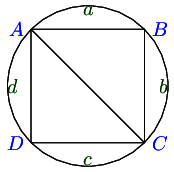

If :math:`a, b, c, d` be the sides and :math:`s` the subperimeter of a cyclic quadrilateral, then its area is :math:`\sqrt{(s -
a)(s - b)(s - c)(s - d)}`

**Proof:** Let :math:`ABCD` be the cyclic quadrilateral having sides :math:`AB = a, BC = b, CD = c` and :math:`AD = d`

Since opposing angles of a quadrilateral are complementary, therefore :math:`B + D = A + C = \pi`

Applying cosine law in :math:`\triangle ABC, \cos B = \frac{a^2 + b^2 - AC^2}{2ab} \Rightarrow AC^2 = a^2 + b^2 - 2ab\cos B`

Similarly, in :math:`\triangle ACD, AC^2 = c^2 + d^2 -2cd\cos(\pi - B) = c^2 + d^2 + 2cd\cos B`

From these two equations, we get :math:`\cos B = \frac{a^2 + b^2 - c^2 - d^2}{2(ab + cd)}`

Area of quadrilateral :math:`ABCD` = Area of :math:`\triangle ABC` + Area of :math:`\triangle ACD`

:math:`= \frac{1}{2}ad\sin B + \frac{1}{2}cd \sin(\pi - B) = \frac{1}{2}(ab + cd)\sin B`

Also, :math:`\sin^2B = 1 - \cos^2B = 1 - \left[\frac{a^2 + b^2 - c^2 - d^2}{2(ab + cd)}\right]^2`

:math:`= \frac{(2ab + 2cd + a^2 + b^2 - c^2 - d^2)(2ab + 2cd - a^2 - b^2 + c^2 + d^2)}{4(ab + cd)^2}`

:math:`= \frac{[(a + b)^2 -(c - d)^2][(c + d)^2 - (a - b)^2]}{4(ab + cd)^2}`

:math:`= \frac{4(s - a)(s - b)(s - c)(s - d)}{4(ab + cd)^2}`

Thus, area of quadrilateral :math:`= \sqrt{(s - a)(s - b)(s - c)(s - d)}`
