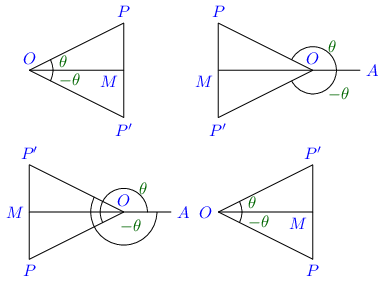

Trigonometrical Ratios of Angle and Sign
****************************************
Values of Trigonometrical Ratios for Some Useful Angles
=======================================================
Angle of :math:`45^\circ`
-------------------------
.. image:: _static/images/6_1_45_triangle.png
   :alt: 45 degree angle
   :align: center

Consider the above figure, which is a right-angle triangle, drawn so that :math:`\angle OMP = 90^\circ` and :math:`\angle MOP =
45^\circ.` We know that sum of all angles of a triangle is equal to :math:`180^\circ.` Thus,

:math:`\angle OPM = 180^\circ - \angle MOP - \angle OMP = 180^\circ - 90^\circ - 45^\circ = 45^\circ`

:math:`\therefore OM = MP.` Let :math:`OP = 2a,` then from Pythogoras theorem, we can write

:math:`4a^2 = OP^2 = OM^2 + MP^2 = 2.OM^2\Rightarrow OM = a\sqrt{2} = MP`

:math:`\sin 45^\circ = \frac{MP}{OP} = \frac{a\sqrt{2}}{2a} = \frac{1}{\sqrt{2}}`

Other trigonometric ratios can be deduced easily from this.

Angle of :math:`30^\circ` and :math:`50^\circ`
----------------------------------------------
.. image:: _static/images/6_1_30_triangle.png
   :alt: 30 degree angle
   :align: center

Consider an equilateral :math:`\triangle OMP`. Let the sides :math:`OM, OP, MP` be each :math:`2a`. We draw a bisector of
:math:`\angle MOP` which will be a perpendicular bisector of :math:`MP` at :math:`X` because the triangle is equilateral. Thus,
:math:`MX = a.` Thus, in :math:`\triangle OMX, OM = 2a, MX = a, \angle MOX = 30^\circ, \angle OXM = 90^\circ` because each angle is
:math:`60^\circ` in an equilateral triangle.

:math:`\sin MOX = \frac{MX}{OM} = \frac{1}{2} \Rightarrow \sin 30^\circ = \frac{1}{2}`

Similarly, :math:`\angle OMX = 60^\circ` because sum of all angles of a triangle is :math:`180^\circ`

:math:`\cos OMX = \frac{MX}{OM} = \frac{1}{2}\Rightarrow \cos 60^\circ = \frac{1}{2}`

All other trigonometric ratios for these can be foun from these two.

Angle of :math:`0^\circ`
------------------------
.. image:: _static/images/6_2_0_triangle.png
   :alt: 0 degree angle
   :align: center

Consider the :math:`\triangle MOP` such that the side MP is smaller than any quantiry we can assign i.e. what we denote by 0. Thus,
:math:`\angle MOP` is what is called approaching :math:`0` or :math:`\lim_{x \to 0}` in terms of Calculus. Why we have to take such
a value is because if any anngle of a triangle is equal to :math:`0^\circ` then the triagle won't exist. Thus these values are
limiting values as you will learn in Calculus.

However, in this case :math:`\sin 0^\circ = \frac{MP}{OP} = \frac{0}{OP} = 0.` Now other trigonometric ratios can be found with
ease.

Angle of :math:`90^\circ`
--------------------------
In the previous figure as :math:`\angle OMP` will approach :math:`0^\circ,` the :math:`\angle OPM` will approach :math:`90^\circ.`
Also, :math:`OP` will approach the length of :math:`OM.` Similar to previos case in right-angle triangle if one angle(other than
right angle) approaches :math:`0^\circ` the other one will approach :math:`90^\circ` and at that value the triangle will cease to
exist.

Thus, :math:`\sin 90^\circ = \frac{OM}{OP} = \frac{OP}{OP} = 1.` Now it is trivial to find other trigonometric ratios.

Given below is a table of most useful angles:

.. list-table:: Values of useful angles
   :header-rows: 1

   * - Angle
     - :math:`0^\circ`
     - :math:`30^\circ`
     - :math:`45^\circ`
     - :math:`60^\circ`
     - :math:`90^\circ`
   * - :math:`\sin`
     - :math:`0`
     - :math:`\frac{1}{2}`
     - :math:`\frac{1}{\sqrt{2}}`
     - :math:`\frac{\sqrt{3}}{2}`
     - :math:`1`
   * - :math:`\cos`
     - :math:`1`
     - :math:`\frac{\sqrt{3}}{2}`
     - :math:`\frac{1}{\sqrt{2}}`
     - :math:`\frac{1}{\sqrt{2}}`
     - :math:`0`
   * - :math:`\tan`
     - :math:`0`
     - :math:`\frac{1}{\sqrt{3}}`
     - :math:`1`
     - :math:`\sqrt{3}`
     - :math:`\infty`
   * - :math:`\cosec`
     - :math:`\infty`
     - :math:`2`
     - :math:`\sqrt{2}`
     - :math:`\frac{2}{\sqrt{3}}`
     - :math:`1`
   * - :math:`\sec`
     - :math:`1`
     - :math:`\frac{2}{\sqrt{3}}`
     - :math:`\sqrt{2}`
     - :math:`2`
     - :math:`\infty`
   * - :math:`\cot`
     - :math:`\infty`
     - :math:`\sqrt{3}`
     - :math:`1`
     - :math:`\frac{1}{\sqrt{3}}`
     - :math:`0`

Complementary Angles
====================
.. image:: _static/images/6_3_complemetary.png
   :alt: complementary angles
   :align: center

Angles are said to be complementary if their sum is equal to one right angle i.e :math:`90^\circ.` Thus, if measure of one angle is
:math:`\theta` the other will automatically be :math:`90^\circ - \theta.`

Consider the above figure. :math:`\triangle OMP` is a right-angle triangle whose :math:`\angle OMP` is a right angle. Since the sum
of all angles is equal to :math:`180^\circ,` therefore sum of :math:`\angle MOP` and :math:`\angle MPO` will be equal to one right
angle or :math:`90^\circ` i.e. they are complementatry angles.

Let :math:`\angle MOP = \theta` then :math:`\angle MPO = 90^\circ - \theta.` When :math:`\angle MPO` is considered :math:`MP`
becomes the base and :math:`OM` becomes the perpendicular.

Thus, :math:`\sin(90^\circ - \theta) = \sin MPO = \frac{MO}{PO} = \cos MOP = \cos \theta`

:math:`\cos(90^\circ - \theta) = \sin MPO = \frac{PM}{PM} = \sin MOP = \sin \theta`

:math:`\tan(90^\circ - \theta) = \tan MPO = \frac{OM}{MP} = \cot MOP = \cot \theta`

Similarly, :math:`\cot(90^\circ - \theta) = \tan \theta`

:math:`\cosec(90^\circ - \theta) = \sec \theta`

:math:`\sec(90^\circ - \theta) = \cosec \theta`

Supplementary Angles
====================
.. image:: _static/images/6_4_supplemntary.png
   :alt: supplemntary angles
   :align: center

Angles are said to be supplementary if their sum is equal to two right angles i.e. :math:`180^\circ.` Thus, if measure of one angle
is :math:`\theta` and oher will automaticaly be :math:`180^\circ - \theta.`

Conside the above figure which include the angles of :math:`180^\circ + \theta.` In each figure :math:`OM` and :math:`OM'` are
drawn in different directions, while :math:`MP` and :math:`M'P'` are drawn in the same direction, so that

:math:`OM' = -OM` and :math:`M'P' = MP`

Hencem we can say that

:math:`\sin(180^\circ - \theta) = \sin MOP' = \frac{M'P'}{OP'} = \frac{MP}{OP} = \sin \theta`

:math:`\cos(180^\circ - \theta) = \cos MOP' = \frac{OM'}{OP'} = \frac{-OM}{OP} = -\cos \theta`

:math:`\tan(180^\circ - \theta) = \tan MOP' = \frac{OM'}{M'P'} = \frac{-OM}{MP} = -\tan \theta`

Similarly, :math:`\cot(180^\circ - \theta) = -\cot \theta`

:math:`\sec(180^\circ - \theta) = -\sec \theta`

:math:`\cosec(180^\circ - \theta) = \cosec \theta`

Angles of :math:`-\theta`
=========================

Consider the above diagram which plots angles of :math:`\theta` and :math:`-\theta.` Note that :math:`MP` and :math:`MP'` are equal
in magnitude but are opposite in sign. Thus, we have

:math:`\sin(-\theta) = \frac{MP'}{OP'} = \frac{-MP}{OP} = -\sin\theta`

:math:`\cos(-\theta) = \frac{OM}{MP'} = \frac{OM}{OP} = \cos\theta`

:math:`\tan(-\theta) = \frac{MP'}{OM} = \frac{-MP}{OM} = -\tan\theta`

Similalry, :math:`\cot(-\theta) = -\cot\theta`

:math:`\sec(-\theta) = \sec\theta`

:math:`\cosec(-\theta) = -\cosec\theta`

Angles of :math:`90^\circ -\theta` and :math:`90^\circ+\theta`
==============================================================
Similarly it can be proven that(diagram has been left as an exercise)

:math:`\sin(90^\circ -\theta) = \cos\theta`

:math:`\cos(90^\circ -\theta) = \sin\theta`

:math:`\tan(90^\circ -\theta) = \cot\theta`

:math:`\cot(90^\circ -\theta) = \tan\theta`

:math:`\sec(90^\circ -\theta) = \cosec\theta`

:math:`\cosec(90^\circ -\theta) = \sec\theta`

:math:`\sin(90^\circ+\theta) = \cos\theta`

:math:`\cos(90^\circ+\theta) = -\sin\theta`

:math:`\tan(90^\circ+\theta) = -\cot\theta`

:math:`\cot(90^\circ+\theta) = -\tan\theta`

:math:`\sec(90^\circ+\theta) = -\cosec\theta`

:math:`\cosec(90^\circ+\theta) = \sec\theta`

Angles of :math:`180^\circ + \theta`
====================================
Angles of :math:`180^\circ + \theta, 270^\circ -\theta, 270^\circ + theta` can be found by using previous relations. For example,

:math:`\sin(180 + \theta) = \sin(90 + 90 + \theta) = \cos(90 + \theta) = -\sin\theta`

:math:`\cos(180 + \theta) = \cos(90 + 90 + \theta) = -\sin(90 + \theta) = -\cos\theta`

:math:`\tan(180 + \theta) = \tan(90 + 90 + \theta) = -\cos(90 + \theta) = \tan\theta`

Similarly, :math:`\cot(180 + \theta) = \cot\theta`

:math:`\sec(180 + \theta) = -\sec\theta`

:math:`\cosec(180 + \theta) = -\cosec\theta`

Angles of :math:`360^\circ + \theta`
====================================
For angles of :math:`\theta` the radius vector makes an angle of :math:`\theta` with initial side. For angles of :math:`360^\circ +
\theta` it will complete a full revolution and then make an angle of :math:`\theta` with initial side. Thus, the trigonometrical
ratios for an angle of :math:`360^\circ + \theta` are the same as those for :math:`\theta.`

It is clear that angle will remain :math:`\theta` for any multiple of :math:`360^\circ.`

Problems
========
1. If :math:`A = 30^\circ,` verify that

   i. :math:`\cos 2A = \cos^2A - \sin^2A = 2\cos^2A - 1`

   ii. :math:`\sin 2A = 2\sin A\cos A`

   iii. :math:`\cos 3A = 4\cos^3A - 3\cos A`

   iv. :math:`\sin 3A = 3\sin A - 4\sin^3A`

   v. :math:`\tan 2A = \frac{2\tan A}{1 - \tan^2 A}`

2. If :math:`A = 45^\circ,` verify that

   i. :math:`\sin 2A = 2\sin A\cos A`

   ii. :math:`\cos 2A = 1 - 2\sin^2A`

   iii. :math:`\tan 2A = \frac{2\tan A}{1 - \tan^2A}`

Verify that

3. :math:`\sin^230^\circ + \sin^245^\circ + \sin^260^\circ = \frac{3}{2}`

4. :math:`\tan^230^\circ + \tan^245^\circ + \tan^260^\circ = 4\frac{1}{3}`

5. :math:`\sin 30^\circ\cos 60^\circ + \sin 60^\circ\cos 30^\circ = 1`

6. :math:`\cos 45^\circ\cos 60^\circ - \sin 45^\circ\sin 60^\circ = -\frac{\sqrt{3} - 1}{2\sqrt{2}}`

7. :math:`\cosec^245^\circ.\sec^230^\circ.\sin^290^\circ.\cos 60^\circ = 1\frac{1}{3}`

8. :math:`4\cot^245^\circ-\sec^260^\circ + \sin^230^\circ = \frac{1}{4}`

Prove that

9. :math:`\sin 420^\circ\cos 300^\circ + \cos(-300^\circ)\sin(-330^\circ) = 1`

10. :math:`\cos 570^\circ\sin 510^\circ -\sin 330^\circ\cos 390^\circ = 0`

What are the values of :math:`\cos A - \sin A` and :math:`\tan A\cot A` when A has the values

11. :math:`\frac{\pi}{3}`

12. :math:`\frac{2\pi}{3}`

13. :math:`\frac{5\pi}{4}`

14. :math:`\frac{7\pi}{4}`

15. :math:`\frac{11\pi}{3}`

What values between :math:`0^\circ` and :math:`360^\circ` may :math:`A` have when

16. :math:`\sin A = \frac{1}{\sqrt{2}}`

17. :math:`\cos A = \frac{1}{2}`

18. :math:`\tan A = -1`

19. :math:`\cot A = -\sqrt{3}`

20. :math:`\sec A = \frac{2}{\sqrt{3}}`

21. :math:`\cosec A = -2`

Express in terms of the ratios of a positive angle, which is less than :math:`\45^\circ,` the quantities

22. :math:`\sin(-65^\circ)`

23. :math:`\cos(-84^\circ)`

24. :math:`\tan 137^\circ`

25. :math:`\sin 168^\circ`

26. :math:`\cos 287^\circ`

27. :math:`\tan(-246^\circ)`

28. :math:`\sin 843^\circ`

29. :math:`\cos(-928^\circ)`

30. :math:`\tan 1145^\circ`

31. :math:`\cos 1410^\circ`

32. :math:`\cot(-1054^\circ)`

33. :math:`\sec 1326^\circ`

34. :math:`\cosec (-756^\circ)`

What sign has :math:`\sin A + \cos A` for the following values of :math:`A`?

35. :math:`140^\circ`

36. :math:`278^\circ`

37. :math:`-356^\circ`

36. :math:`-1125^\circ`

What sign has :math:`\sin A - \cos A` for the following values of :math:`A`?

37. :math:`215^\circ`

38. :math:`825^\circ`

39. :math:`-634^\circ`

40. :math:`-457^\circ`

41. Find the sine and cosine of all angled in the first four quadrants whose tangents are equal to :math:`\cos 135^\circ.`

Prove that

42. :math:`\sin(270^\circ + A) = -\cos A` and :math:`\tan(270^\circ + A) = -\cot A`

43. :math:`\cos(270^\circ - A) = -\sin A` and :math:`cot(270^\circ - A) = \tan A`

44. :math:`\cos A + \sin(270^\circ + A) - \sin(270^\circ - A) + \cos(180^\circ + A) = 0`

45. :math:`\sec(270^\circ - A)\sec(90^\circ - A) - \tan(270^\circ - A)\tan(90^\circ + A) + 1 = 0`

46. :math:`\cot A + \tan(180^\circ + A) + \tan(90^\circ + A) + \tan(360^\circ - A) = 0`

47. Find the value of :math:`2\tan^245\circ - \sin^260^\circ - \frac{1}{2}\cot^230^\circ + \frac{1}{8}\sec^245^\circ`

48.  Simplify :math:`\frac{\sin 300^\circ.\tan 330^\circ.\sec 420^\circ}{\tan 135^\circ.\sin 210^\circ.\sec 315^\circ}`

49. Show that :math:`\tan 1^\circ\tan 2^\circ \ldots \tan 89^\circ = 1`

50. Show that :math:`\sin^25^\circ + \sin^210^\circ + \sin^215^\circ + \ldots + \sin^290^\circ = 9\frac{1}{2}`

51. Find the value of :math:`\cos^2\frac{\pi}{16} + \cos^2\frac{3\pi}{16} + \cos^2\frac{5\pi}{16} + \cos^2\frac{7\pi}{16}`

Find the value of the following:

52. :math:`\sec^2\frac{\pi}{6}\sec^2\frac{\pi}{4} + \tan^2\frac{\pi}{3}\sin^2\frac{\pi}{2}`

53. :math:`\cot^230^\circ - 2\cos^260^\circ - \frac{3}{4}\sin^245^\circ - 4\sin^230^\circ`

54. :math:`\frac{\sec 480^\circ\cosec 570^\circ.\tan 330^\circ}{\sin 600^\circ.\cos 660^\circ.\cot 405^\circ}`

55. If :math:`A = 30^\circ,` show that :math:`\cos^6A + \sin^6A = 1 - \sin^2A\cos^2A`

56. Show that :math:`\left(\tan \frac{\pi}{4} + \cot \frac{\pi}{4} + \sec\frac{\pi}{4}\right)\left(\tan \frac{\pi}{4} + \cot
    \frac{\pi}{4} - \sec \frac{\pi}{4}\right) = \cosec^2 \frac{\pi}{4}`

57. Show that :math:`\sin^26^\circ + \sin6^212^\circ + \sin^218^\circ + \ldots + \sin^284^\circ + \sin^290^\circ = 8`

58. Show that :math:`\tan 9^\circ.\tan 27^\circ.\tan 45^\circ.\tan 63^\circ.\tan 81^\circ = 1`

59. Show that :math:`\sum_{r = 1}^9 \sin^2\frac{r\pi}{18} = 5`

60. If :math:`4n\alpha = \pi,` show that :math:`\tan\alpha\tan2\alpha\tan3\alpha. \ldots .\tan(2n - 2)\alpha\tan(2n - 1)\alpha = 1`
