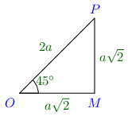
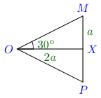
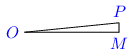
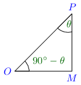

Trigonometrical Ratios of Angle and Sign
****************************************
Values of Trigonometrical Ratios for Some Useful Angles
=======================================================
Angle of :math:`45^\circ`
-------------------------

Consider the above figure, which is a right-angle triangle, drawn so that :math:`\angle OMP = 90^\circ` and :math:`\angle MOP =
45^\circ.` We know that sum of all angles of a triangle is equal to :math:`180^\circ.` Thus,

:math:`\angle OPM = 180^\circ - \angle MOP - \angle OMP = 180^\circ - 90^\circ - 45^\circ = 45^\circ`

:math:`\therefore OM = MP.` Let :math:`OP = 2a,` then from Pythogoras theorem, we can write

:math:`4a^2 = OP^2 = OM^2 + MP^2 = 2.OM^2\Rightarrow OM = a\sqrt{2} = MP`

:math:`\sin 45^\circ = \frac{MP}{OP} = \frac{a\sqrt{2}}{2a} = \frac{1}{\sqrt{2}}`

Other trigonometric ratios can be deduced easily from this.

Angle of :math:`30^\circ` and :math:`50^\circ`
----------------------------------------------

Consider an equilateral :math:`\triangle OMP`. Let the sides :math:`OM, OP, MP` be each :math:`2a`. We draw a bisector of
:math:`\angle MOP` which will be a perpendicular bisector of :math:`MP` at :math:`X` because the triangle is equilateral. Thus,
:math:`MX = a.` Thus, in :math:`\triangle OMX, OM = 2a, MX = a, \angle MOX = 30^\circ, \angle OXM = 90^\circ` because each angle is
:math:`60^\circ` in an equilateral triangle.

:math:`\sin MOX = \frac{MX}{OM} = \frac{1}{2} \Rightarrow \sin 30^\circ = \frac{1}{2}`

Similarly, :math:`\angle OMX = 60^\circ` because sum of all angles of a triangle is :math:`180^\circ`

:math:`\cos OMX = \frac{MX}{OM} = \frac{1}{2}\Rightarrow \cos 60^\circ = \frac{1}{2}`

All other trigonometric ratios for these can be foun from these two.

Angle of :math:`0^\circ`
------------------------

Consider the :math:`\triangle MOP` such that the side MP is smaller than any quantiry we can assign i.e. what we denote by 0. Thus,
:math:`\angle MOP` is what is called approaching :math:`0` or :math:`\lim_{x \to 0}` in terms of Calculus. Why we have to take such
a value is because if any anngle of a triangle is equal to :math:`0^\circ` then the triagle won't exist. Thus these values are
limiting values as you will learn in Calculus.

However, in this case :math:`\sin 0^\circ = \frac{MP}{OP} = \frac{0}{OP} = 0.` Now other trigonometric ratios can be found with
ease.

Angle of :math:`90^\circ`
--------------------------
In the previous figure as :math:`\angle OMP` will approach :math:`0^\circ,` the :math:`\angle OPM` will approach :math:`90^\circ.`
Also, :math:`OP` will approach the length of :math:`OM.` Similar to previos case in right-angle triangle if one angle(other than
right angle) approaches :math:`0^\circ` the other one will approach :math:`90^\circ` and at that value the triangle will cease to
exist.

Thus, :math:`\sin 90^\circ = \frac{OM}{OP} = \frac{OP}{OP} = 1.` Now it is trivial to find other trigonometric ratios.

Given below is a table of most useful angles:

.. list-table:: Values of useful angles
   :header-rows: 1

   * - Angle
     - :math:`0^\circ`
     - :math:`30^\circ`
     - :math:`45^\circ`
     - :math:`60^\circ`
     - :math:`90^\circ`
   * - :math:`\sin`
     - :math:`0`
     - :math:`\frac{1}{2}`
     - :math:`\frac{1}{\sqrt{2}}`
     - :math:`\frac{\sqrt{3}}{2}`
     - :math:`1`
   * - :math:`\cos`
     - :math:`1`
     - :math:`\frac{\sqrt{3}}{2}`
     - :math:`\frac{1}{\sqrt{2}}`
     - :math:`\frac{1}{\sqrt{2}}`
     - :math:`0`
   * - :math:`\tan`
     - :math:`0`
     - :math:`\frac{1}{\sqrt{3}}`
     - :math:`1`
     - :math:`\sqrt{3}`
     - :math:`\infty`
   * - :math:`\cosec`
     - :math:`\infty`
     - :math:`2`
     - :math:`\sqrt{2}`
     - :math:`\frac{2}{\sqrt{3}}`
     - :math:`1`
   * - :math:`\sec`
     - :math:`1`
     - :math:`\frac{2}{\sqrt{3}}`
     - :math:`\sqrt{2}`
     - :math:`2`
     - :math:`\infty`
   * - :math:`\cot`
     - :math:`\infty`
     - :math:`\sqrt{3}`
     - :math:`1`
     - :math:`\frac{1}{\sqrt{3}}`
     - :math:`0`

Complementary Angles
====================

Angles are said to be complementary if their sum is equal to one right angle i.e :math:`90^\circ.` Thus, if measure of one angle is
:math:`\theta` the other will automatically be :math:`90^\circ - \theta.`

Consider the above figure. :math:`\triangle OMP` is a right-angle triangle whose :math:`\angle OMP` is a right angle. Since the sum
of all angles is equal to :math:`180^\circ,` therefore sum of :math:`\angle MOP` and :math:`\angle MPO` will be equal to one right
angle or :math:`90^\circ` i.e. they are complementatry angles.

Let :math:`\angle MOP = \theta` then :math:`\angle MPO = 90^\circ - \theta.` When :math:`\angle MPO` is considered :math:`MP`
becomes the base and :math:`OM` becomes the perpendicular.

Thus, :math:`\sin(90^\circ - \theta) = \sin MPO = \frac{MO}{PO} = \cos MOP = \cos \theta`

:math:`\cos(90^\circ - \theta) = \sin MPO = \frac{PM}{PM} = \sin MOP = \sin \theta`

:math:`\tan(90^\circ -\ theta) = \tan MPO = \frac{OM}{MP} = \cot MOP = \cot \theta`

Similarly, :math:`\cot(90^\circ - \theta) = \tan \theta`

:math:`\cosec(90^\circ - \theta) = \sec \theta`

:math:`\sec(90^\circ - \theta) = \cosec \theta`

Supplemntary Angles
===================
Angles are said to be supplementary if their sum is equal to two right angles i.e. :math:`180^\circ.` Thus, if measure of one angle
is :math:`\theta` and oher will automaticaly be :math:`180^\circ - \theta.`
