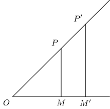

Trigonometrical Ratios
**********************
From Geometry, we know that an acute angle is an angle whose measure is between :math:`0^\circ` and :math:`90^\circ`.
Consider the following figure:

This picture contains two similar triangles :math:`\triangle OMP` and :math:`\triangle OM'P'.` We are interested in :math:`\angle
MOP` or :math:`\angle M'OP'`. In the :math:`\triangle MOP` and :math:`\triangle M'OP', OP, OP'` are called hypotenuses i.e sides
opposite to right angle, :math:`PM, P'M'` are called perpendiculars i.e. sides opposite to angle of interest and :math:`OM, OM'` are
called bases i.e the third angle.

Hypotenuses are usually denoted by :math:`h,` perpendiculars by :math:`p` and bases by :math:`b.` Let :math:`OM = b, OM' = b', PM =
b, P'M'=b', OP= h, OP'=h'.` Since the two triangles are similar :math:`\frac{p}{p'} = \frac{b}{b'} = \frac{h}{h'}` Thus the ratio
of any two sides is dependent purely on :math:`\angle O` or :math:`\angle MOP` or :math:`\angle M'OP'`

Since there are :math:`3` sides we can choose :math:`2` in :math:`{}^3C_2` i.e :math:`3` ways and for each combination a there will
be two permutations where a side can be in either numerator or denominator. From this we can conclude that there will be six
ratios(these are called trigonometrical ratios). These six trigonometrical ratios or functions are given below:

:math:`\frac{MP}{OP}` or :math:`\frac{\text{perp.}}{\text{hyp.}}` or :math:`\frac{p}{h}` is called the **Sine** of the :math:`\angle
MOP`

:math:`\frac{OM}{OP}` or :math:`\frac{\text{base}}{\text{hyp.}}` or :math:`\frac{b}{h}` is called the **Cosine** of the
:math:`\angle MOP`

:math:`\frac{MP}{OM}` or :math:`\frac{\text{perp.}}{\text{base}}` or :math:`\frac{p}{b}` is called the **Tangent** of the :math:`\angle
MOP`

:math:`\frac{OM}{MP}` or :math:`\frac{\text{base}}{\text{perp.}}` or :math:`\frac{b}{p}` is called the **Cotangent** of the
:math:`\angle MOP`

:math:`\frac{OP}{OM}` or :math:`\frac{\text{hyp.}}{\text{base}}` or :math:`\frac{h}{b}` is called the **Secant** of the
:math:`\angle MOP`

:math:`\frac{OP}{MP}` or :math:`\frac{x\text{hyp.}}{\text{perp.}}` or :math:`\frac{h}{p}` is called the **Cosecant** of the
:math:`\angle MOP`

:math:`1 - \cos MOP` is called **Versed Sine** of :math:`\angle MOP` and :math:`1 - \sin MOP` is called **Coversed sine** of
:math:`\angle MOP`. These two are rarely used in trigonometry.

It should be noted that the trigonometrical ratios are all numbers.

The name of all trigonometric ration are wriiten for, for brevity, :math:`\sin MOP, \cos MOP, \tan MOP, \cot MOP, \sec MOP, \cosec
MOP, \text{vers~} MOP, \text{coverse~} MOP.`

Relationship betweeen Trigonometrical Functions or Ratios
=========================================================
Let us represent the :math:`\angle MOP` with :math:`\theta,` we observe from previous section that

:math:`\sin \theta = \frac{1}{\cosec\theta}, \cos\theta = \frac{1}{\sec\theta}, \tan\theta = \frac{1}{\cot\theta}`

Also that :math:`\cosec\theta = \frac{1}{\sin\theta}, \sec\theta = \frac{1}{\cos\theta}, \cot\theta = \frac{1}{\tan\theta}`

We also observe that :math:`\tan\theta = \frac{\sin\theta}{\cos\theta}` and :math:`\cot\theta = \frac{\cos\theta}{\sin\theta}`

Form Pythagoras theorem in Geometry, we know that :math:`\text{hypotenuse}^2 = \text{perpendicular}^2 + \text{base}^2` or
:math:`h^2 = p^2 + b^2`

i. Dividing both sides by :math:`h^2,` we get

   :math:`\frac{p^2}{h^2} + \frac{b^2}{h^2} = 1`

   :math:`\sin^2 \theta + \cos^2\theta = 1`

   We can rewrite this as :math:`\sin^2\theta = 1 - \cos^2\theta, \cos^2\theta = 1 - \sin^2\theta, \sin\theta = \sqrt{1 -
   \cos^2\theta}, \cos\theta = \sqrt{1 - \sin^2\theta}`

ii. Divising both sides by :math:`b^2,` we get

    :math:`\frac{h^2}{b^2} = \frac{p^2}{b^2} + 1`

    :math:`\sec^2\theta = \tan^2\theta + 1`

    We can rewrite this as :math:`\sec^2\theta - \tan^2\theta = 1, \tan^2\theta = \sec^2\theta - 1, \sec\theta = \sqrt{1 +
    \tan^2\theta}, \tan\theta = \sqrt{\sec^2\theta - 1}`

iii. Divising both sides by :math:`p^2,` we get

     :math:`\frac{h^2}{p^2} = 1 + \frac{b^2}{p^2}`

     :math:`\cosec^2\theta = 1 + \cot^2\theta`

     We can rewrite this as :math:`\cosec^2\theta - \cot^2\theta = 1, \cot^2\theta = \cosec^2\theta - 1, \cosec\theta = \sqrt{1 +
     \cot^2\theta}, \cot\theta = \sqrt{\cosec^2\theta - 1}`

Problems
========
Prove the following:

1. :math:`\sqrt{\frac{1 - \cos A}{1 + \cos A}} = \cosec A - \cot A`

2. :math:`\sqrt{\sec^2A + \cosec^2A} = \tan A + \cot A`

3. :math:`(\cosec A - \sin A)(\sec A - \cos A)(\tan A + \cot A) = 1`

4. :math:`\cos^4 A - \sin^4 A + 1 = 2\cos^2 A`

5. :math:`(\sin A + \cos A)(1 - \sin A\cos A) = \sin^3A + \cos^3A`

6. :math:`\frac{\sin A}{1 + \cos A}+\frac{1 + \cos A}{\sin A} = 2\cosec A`

7. :math:`\sin^6A - cos^6A = 1 - 3\cos^2A\sin^2A`

8. :math:`\sqrt{\frac{1 - \sin A}{1 + \sin A}} = \sec A - \tan A`

9. :math:`\frac{\cosec A}{\cosec A - 1} + \frac{\cosec A}{\cosec A + 1} = 2\sec^2 A`

10. :math:`\frac{\cosec A}{\tan A + \cot A} = \cos A`

11. :math:`(\sec A + \cos A)(\sec A - \cos A) = \tan^2 A + \sin^2A`

12. :math:`\frac{1}{\tan A + \cot A} = \sin A\cos A`

13. :math:`\frac{1 - \tan A}{1 + \tan A} = \frac{\cot A - 1}{\cot A + 1}`

14. :math:`\frac{1 + \tan^2A}{1 + \cot^2A} = \frac{\sin^2A}{\cos^2A}`

15. :math:`\frac{\sec A - \tan A}{\sec A + \tan A} = 1 - 2\sec A\tan A + 2\tan^2 A`

16. :math:`\frac{1}{\sec A - \tan A} = \sec A + \tan A`

17. :math:`\frac{\tan A}{1 - \cot A} + \frac{\cot A}{1 - \tan A} = \sec A\cosec A+ 1`

18. :math:`\frac{\cos A}{1 - \tan A} + \frac{\sin A}{1 - \cot A} = \sin A + \cos A`

19. :math:`(\sin A + \cos A)(\tan A + \cot A) = \sec A + \cosec A`

20. :math:`\sec^4A - \sec^2A = \tan^4A + \tan^2A`

21. :math:`\cot^4A + \cot^2A = \cosec^4A - \cosec^2A`

22. :math:`\sqrt{\cosec^2A - 1} = \cos A\cosec A`

23. :math:`\sec^2A\cosec^2A = \tan^2A + \cot^2A + 2`

24. :math:`\tan^2A - \sin^2A = \sin^4A \sec^2A`

25. :math:`(1 + \cot A - \cosec A)(1 + \tan A + \sec A) = 2`

26. :math:`\frac{\cot A\cos A}{\cot A + \cos A} = \frac{\cot A - \cos A}{\cot A \cos A}`

27. :math:`\frac{\cot A + \tan B}{\cot B + \tan A} = \cot A \tan B`

28. :math:`\left(\frac{1}{\sec^2 A - \cos^2A} + \frac{1}{\cosec^2A - \sin^2A}\right)\cos^2A\sin^2A = \frac{1 - \cos^2A\sin^2A}{2 +
    \cos^2A\sin^2A}`

29. :math:`\sin^8A - \cos^8A = (\sin^2A - \cos^2A)(1 - 2\sin^2A\cos^2A)`

30. :math:`\frac{\cos A\cosec A - \sin A\sec A}{\cos A + \sin A} = \cosec A - \sec A`

31. :math:`\frac{1}{\cosec A - \cot A} - \frac{1}{\sin A} = \frac{1}{\sin A} - \frac{1}{\cosec A + \cot A}`

32. :math:`\frac{\tan A + \sec A - 1}{\tan A - \sec A + 1} = \frac{1 + \sin A}{\cos A}`

33. :math:`(\tan A + \cosec B)^2 - (\cot B - \sec A)^2 = 2\tan A\cot B(\cosec A + \sec B)`

34. :math:`2\sec^2 A - \sec^4A - 2\cosec^2A + \cosec^4A = \cot^4A - \tan^4A`

35. :math:`(\sin A + \cosec A)^2 + (\cos A + \sec A)^2 = \tan^2A + \cot^2A + 7`

36. :math:`(\cosec A + \cot A)(1 - \sin A) - (\sec A + \tan A)(1 - \cos A) = (\cosec A - \sec A)[2 - (1 - \cos A)(1 - \sin A)]`

37. :math:`(1 + \cot A + \tan A)(\sin A - \cos A) = \frac{\sec A}{\cosec^2A} - \frac{\cosec A}{\sec^2A}`

38. :math:`\frac{1}{\sec A - \tan A} - \frac{1}{\cos A} = \frac{1}{\cos A} - \frac{1}{\sec A + \tan A}`

39. :math:`3(\sin A - \cos A)^4 + 4(\sin^6 A + \cos^6 A) + 6(\sin A + \cos A)^2 = 13`

40. :math:`\sqrt{\frac{1 + \cos A}{1 - \cos A}} = \cosec A + \cot A`

41. :math:`\frac{\cos A}{1 + \sin A} + \frac{\cos A}{1 - \sin A} = 2\sec A`

42. :math:`\frac{\tan A}{\sec A - 1} + \frac{\tan A}{\sec A + 1} = 2\cosec A`

43. :math:`\frac{1}{1 - \sin A} - \frac{1}{1 + \sin A} = 2\sec A\tan A`

44. :math:`\frac{1 + \tan^2 A}{1 + \cot^2 A} = \left(\frac{1 - \tan A}{1 - \cot A}\right)^2`

45. :math:`1 + \frac{2\tan^2 A}{\cos^2 A} = \tan^4 A + sec^4 A`

46. :math:`(1 - \sin A - \cos A)^2 = 2(1 - \sin A)(1 - \cos A)`

47. :math:`\frac{\cot A + \cosec A - 1}{\cot A - \cosec A + 1} = \frac{1 + \cos A}{\sin A}`

48. :math:`(\sin A + \sec A)^2 + (\cos A + \cosec A)^2 = (1 + \sec A\cosec A)^2`

49. :math:`\frac{2\sin A\tan A(1 - \tan A) + 2\sin A\sec^2A}{(1 + \tan A)^2} = \frac{2\sin A}{1 + \tan A}`

50. If :math:`2\sin A = 2 - \cos A,` find :math:`\sin A.`

51. If :math:`8\sin A = 4 + \cos A,` find :math:`\sin A.`

52. If :math:`\tan A + \sec A = 1.5,` find :math:`\sin A.`

53. If :math:`\cot A + \cosec A = 5,` find :math:`\cos A.`

54. If :math:`3\sec^4 A + 8 = 10\sec^2A,` find the value of :math:`\tan A.`

55. If :math:`\tan^2A + \sec A = 5,` find :math:`\cos A.`

56. If :math:`\tan A + \cot A = 2,` find :math:`\sin A.`

57. If :math:`\sec^2A = 2 + 2\tan A,` find :math:`\tan A.`

58. If :math:`\tan A = \frac{2x(x + 1)}{2x + 1},` find :math:`\sin A` and :math:`\cos A.`

59. If :math:`3\sin A + 5\cos A = 5,` show that :math:`5\sin A - 3\cos A = \pm 3`

60. If :math:`(\sec A + \tan A) = (\sec A - \tan A)` prove that each side is :math:`\pm 1`

61. If :math:`\frac{\cos^4 A}{\cos^2 B} + \frac{\sin^4 A}{\sin^2 B} = 1,` prove that

    i. :math:`\sin^4A + \sin^4B = 2\sin^A \sin^B`

    ii. :math:`\frac{\cos^4 B}{\cos^2 A} + \frac{\sin^4 B}{\sin^2 A} = 1,`

62. If :math:`\cos A + \sin A = \sqrt{2}\cos A,` prove that :math:`\cos A - \sin A = \pm \sqrt{2}\sin A`

63. If :math:`a\cos A - b\sin A = c,` prove that :math:`a\sin A + b\cos A = \sqrt{a^2 + b ^2 - c^2}`

64. If :math:`1 - \sin A = 1 + \sin A` then prove that value of each side is :math:`\pm \cos A`

65. If :math:`\sin^4 A + \sin^2 A = 1,` prove that

    i. :math:`\frac{1}{\tan^4 A} + \frac{1}{\tan^2A} = 1`

    ii. :math:`\tan^4A - \tan^2 = 1`

66. If :math:`\cos^2 - \sin^2 A = \tan^2 B,` prove that :math:`2\cos^2B - 1 = \cos^2B - \sin^2B = \tan^2A`

67. If :math:`\sin A + \cosec A = 2,` then prove that :math:`\sin^nA + \cosec^nA = 2`

68. If :math:`\tan^2 A = 1 - e^2,` prove that :math:`\sec A + \tan^3A\cosec A = (2 - e^2)^\frac{3}{2}`

69. Eliminate :math:`A` between the equations :math:`a\sec A + b\tan A + c = 0` and :math:`p\sec A + q\tan B + r = 0`

70. If :math:`\cosec A - \sin A = m` and :math:`\sec A - \cos A = n,` elimiate :math:`A`

71. Is the equation :math:`\sec^2 A = \frac{4xy}{(x + y)^2}` possible for real values of :math:`x` and :math:`y`?

72. Show that the equation :math:`\sin A = x + \frac{1}{x}` is imossible for real values of :math:`x.`

73. If :math:`\sec A - \tan A = p, p\neq 0,` find :math:`\tan A, \sec A` and :math:`\sin A.`

74. If :math:`\sec A = p + \frac{1}{4p},` show that :math:`\sec A + \tan A = 2p` or :math:`\frac{1}{2p}.`

75. If :math:`\frac{\sin A}{\sin B} = p, \frac{\cos A}{\cos B} = q,` find :math:`\tan A` and :math:`\tan B.`

76. If :math:`\frac{\sin A}{\sin B} = \sqrt{2}, \frac{\tan A}{\tan B}= \sqrt{3},` find :math:`A` and :math:`B.`

77. If :math:`\tan A + \cot B = 2,` find :math:`\sin A.`

78. If :math:`m = \tan A + \sin A` and :math:`n = \tan A - \sin A,` prove that :math:`m^2 - n^2 = 4\sqrt{mn}.`

79. If :math:`\sin A + \cos A = m` and :math:`\sec A + \cosec A = n,` prove that :math:`n(m^2 - 1) = 2m.`

80. If :math:`x\sin^3 A + y\cos^3 A = \sin A\cos A` and :math:`x\sinA - y\cos A = 0,` prove that :math:`x^2 + y^2 + 1 = 0`

81. Prove that :math:`\sin^2A = \frac{(x + y)^2}{4xy}` is possible for real values of :math:`x` and :math:`y` onlt when :math:`x =
    y` and :math:`x,y \neq 0`
